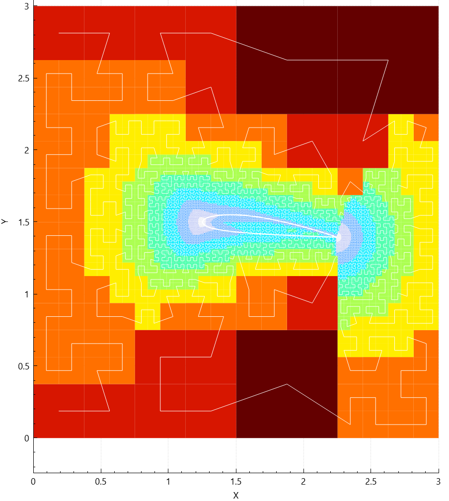
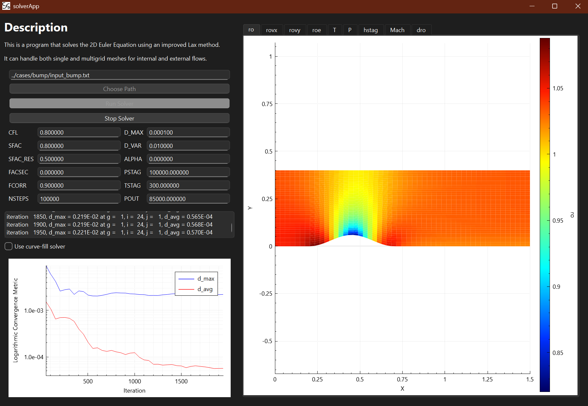

# 4A2 - Computational Fluid Dynamics

IIB Engineering module — Euler equation solver for compressible inviscid flow on structured block meshes, with a Qt GUI, Python parameter sweep tooling, and an ongoing AMR extension using a Hilbert space-filling curve.

## Project structure

```
solver/
  block_mesh_solver/     Structured block mesh Euler solver (coursework)
  curve_fill_solver/     AMR solver on Hilbert curve (extension, in progress)
  gui/                   Qt visualisation widgets
  types.f90 / types.h    Shared Fortran/C interop types
  qtio.f90               Fortran → Qt signal bridge
cases/                   Test case input files (bend, bump, naca0012, naca2412, ...)
preprocessing/           Python scripts for geometry and case generation
postprocessing/          Python scripts for plotting Cp, Mach, convergence
report/                  Interim and final reports with figures
```

## Building

Requires gfortran (MinGW64), Qt 6, CMake ≥ 3.16.

```bash
mkdir build && cd build
cmake .. -G "MinGW Makefiles"
cmake --build . -j8
```

After a `types.f90` change, stale `.mod` files can cause spurious errors — do a full clean rebuild:

```bash
rm -rf build && mkdir build && cd build
cmake .. -G "MinGW Makefiles" && cmake --build . -j8
```

## Block mesh solver

Solves the 2D Euler equations on structured curvilinear block meshes using a finite volume time-marching method with Lax-Friedrichs flux.

### Improvements over the skeleton code

**Runge-Kutta (RK4)** — intermediate timesteps with linearly increasing step sizes (3/8-rule variant). More stable at high CFL; more computationally expensive per iteration.

**Deferred correction** — artificial viscosity is gradually reduced as the solution converges. A correction variable `corr` slowly approaches `fcorr × (prop - prop_average)`, cancelling out smoothing at steady state. Improves final accuracy for a given `sfac`.

**Residual averaging** — primary flow variables are smoothed each iteration:
```
dcell = (1 - sfac_res) × dcell + sfac_res × dcell_avg
```
Stabilises the solver at higher CFL numbers, allowing faster convergence.

**Spatially varying (local) timestep** — each cell uses its own stable timestep `Δt = l_min / (a + v)`, updated every 10 iterations. Significantly reduces iteration count to steady state on non-uniform meshes.

**Convergence detection** — solver stops when the last 100 values of `d_avg` (sampled every 50 iterations) are all within a factor of `d_var` of their mean, avoiding unnecessary iterations after convergence. Four outcomes: converged within bounds, converged outside bounds, diverged, or max iterations reached.

**Figure of merit** — `FM = log10(1 / (d_avg × T))`: accuracy per unit runtime. Used to identify optimal parameter combinations.

### GUI

Qt application with solver inputs, a live convergence graph, and interactive flow-field visualisation tabs (Cp, Mach, density, etc.). Zoom and pan state is preserved between tab switches and frame updates.

### Python parameter sweep worker

A thread-pool worker (`case_env/`) runs the solver across a parameter grid in parallel (8 threads). Each worker creates its own case directory, runs the solver, and writes results to a shared CSV in a thread-safe way. Used to generate the effort-vs-accuracy plots.

### Test cases

| Case | Description |
|------|-------------|
| `bend` | 90° channel bend |
| `bump` | Subsonic bump in a channel |
| `naca0012` | Symmetric aerofoil at various angles of attack |
| `naca2412` | Cambered aerofoil — Cl/Cd vs α sweep |
| `turbine_c` | Turbine cascade, coarse mesh topology |
| `turbine_h` | Turbine cascade, fine mesh topology |
| `tube` | 1D Sod shock tube |
| `waves` | Acoustic wave propagation |

Default solver parameters used in the report:

| Case | cfl | sfac | sfac_res | fcorr | ni | nj |
|------|-----|------|----------|-------|----|----|
| bend | 0.20 | 0.80 | 0.50 | 0.90 | 53 | 37 |
| bump | 0.80 | 0.80 | 0.50 | 0.90 | 53 | 37 |
| naca0012 | 0.20 | 0.60 | 0.50 | 0.60 | — | — |
| naca2412 | 0.05 | 0.60 | 0.50 | 0.60 | — | — |
| turbine_c | 0.10 | 0.60 | 0.50 | 0.80 | — | — |
| turbine_h | 0.10 | 0.80 | 0.00 | 0.90 | — | — |

### Key results

- A figure of merit `FM = log10(1 / (d_avg × T))` is defined to quantify solver efficiency (accuracy per unit runtime) and used to compare parameter combinations.
- Lift coefficient scales linearly with angle of attack for NACA0012 and NACA2412, but the gradient is ~4× lower than the inviscid 2π. This is likely caused by the far-field boundary being fixed to horizontal freestream regardless of angle of attack, on a domain only 2.5 chord lengths tall.
- Optimal mesh size for the bump case is around ni = 200, giving FM ≈ 4.5 beyond which floating point precision limits further accuracy gains.
- Turbine Cp distributions match experimental data well on both coarse and fine mesh topologies.

## Curve-fill AMR solver (extension, in progress)

A separate research extension implementing an unstructured adaptive mesh on a 2D Hilbert space-filling curve quad-tree. Work ongoing — not part of the submitted coursework.

Cells are refined near the airfoil surface based on a weighted combination of wall distance and surface curvature:

- `w_dist = exp(-dist / dist_ref)` — exponential decay from surface
- `w_kappa = log(κ / κ_min) / log(κ_max / κ_min)` — log-normalised curvature (handles ~2000:1 LE-to-mid-chord ratio)
- `refinement = 0.7 × w_dist + 0.3 × w_kappa`

Ghost cells enforce flow-tangency at solid walls via a mirror-point immersed boundary method. The Euler solver uses Lax-Friedrichs flux with per-cell local timestepping and CFL ≤ 0.4.

| | |
|---|---|
|  |  |
| AMR mesh coloured by refinement level | Pressure field on bump case |
